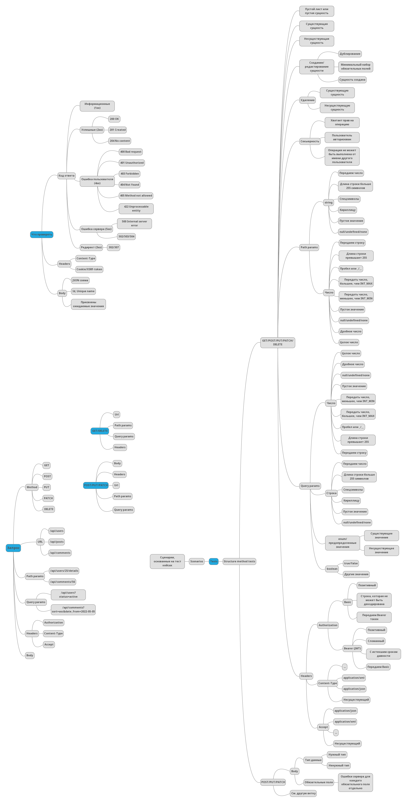

Rest - (Архитектурный стиль) это набор согласованных ограничений и принципов проектирования,
позволяющий добиться определённых свойств системы.
КОНЦЕПЦИИ REST 
1. ВСЕ ЕСТЬ РЕСУРС (ALL IS RESOURCE)
2. У КАЖДОГО РЕСУРСА ЕСТЬ URL

Принципы REST
 1. Клиент-серверная архитектура (Разделение функций клиента и сервера).\
    \+ Позволяет масштабировать приложение .\
    \+ Упрощает поддержу приложения (изменения происходят на сервере и не затрагивают клиента) .\
    \- Единая точка отказа в ввиде сервера \.

 2. Stateless (сервер не должен хранить у себя информацию о сессии с клиентом.
    Он должен в каждом запросе получать всю информацию для обработки.).\
    \+ Масштабируемость сервера.\
    \+ Уменьшение времени обработки.\
    \+ Упрощение поддержки.\
    \+ Кэширование\.

 3. Кэширование (временное хранение информации из прошлых запросов  для повторного использования).\
    \+ уменьшение количества сетевых взаимодействий -> время отклика .\
    \+ уменьшение нагрузки на систему\.

 4. Единообразие интерфейса(Hypermedia As The Engine Of Application State-
    Гипермедиа как двигатель состояния приложения)Запрос HATEOAS позволяет вам не только отправлять данные, но и указывать связанные действия.\
    \+ клиент становится очень гибким в плане изменений на сервере с точки зрения изменения допустимых действий, изменения модели данных и т.д.\
    \- усложнение логики\.

 5. Layered system(Концепция слоистой архитектуры заключается в том, что ни клиент,
    ни сервер не должны знать о том, как происходит цепочка вызовов дальше своих прямых соседей).\
    \+ возможность добавлять новые компонеты
    \- увеличение количества сетевых взаимодействий

 6. Code on demand(исполняемый программный код с серверного компьютера на клиентский компьютер по запросу программного обеспечения клиента.)
  
Ограничения REST опциональны (необязательны) кроме  CODE ON DEMAND

МЕТОДЫ HTTPS  методы могут быть безопасными, идемпотентными или кешируемыми.

Метод HTTP является идемпотентным, если повторный идентичный запрос, сделанный один или несколько раз подряд,
имеет один и тот же эффект, не изменяющий состояние сервера.
Другими словами, идемпотентный метод не должен иметь никаких побочных эффектов (side-effects),
кроме сбора статистики или подобных операций. Корректно реализованные методы GET, HEAD, PUT и DELETE идемпотентны,
но не метод POST.
Также все безопасные методы являются идемпотентными.

***GET*** - запрашивает представление ресурса. Запросы с использованием этого метода могут только извлекать данные.\
***HEAD*** - запрашивает ресурс так же, как и метод GET, но без тела ответа.\
***POST***- используется для отправки сущностей к определённому ресурсу. Часто вызывает изменение состояния или какие-то побочные эффекты на сервере.\
***PUT*** - заменяет все текущие представления ресурса данными запроса.\
***DELETE*** - удаляет указанный ресурс.\
***CONNECT*** - устанавливает "туннель" к серверу, определённому по ресурсу.\
***OPTIONS*** - используется для описания параметров соединения с ресурсом.\
***TRACE*** - выполняет вызов возвращаемого тестового сообщения с ресурса.\
***PATCH*** - используется для частичного изменения ресурса.

[Заголовки HTTP](https://developer.mozilla.org/ru/docs/Web/HTTP/Headers) \
[Куки](https://developer.mozilla.org/ru/docs/Web/HTTP/Cookies) \
[URL/URI](https://habr.com/ru/post/232385/?ysclid=l1rkyxuoow) \
***ТЕСТ ДИЗАЙН***

